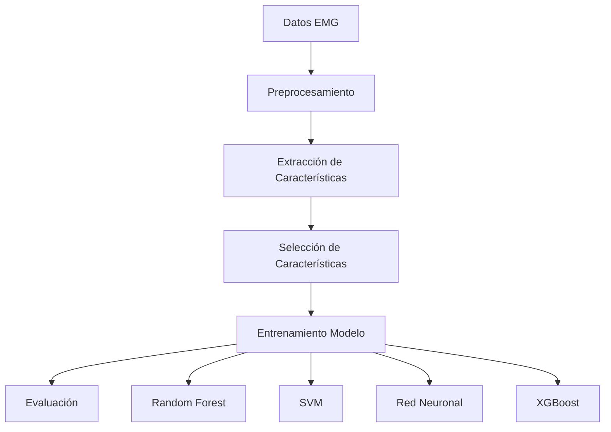
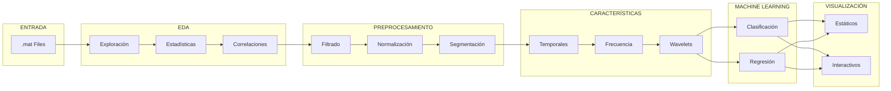

# Plan de Ciencia de Datos para Análisis de Archivos .mat de NinaPro

## Descripción General

Este documento presenta un plan detallado para el análisis de señales EMG provenientes de la base de datos NinaPro (Non-Invasive Adaptive Hand Prosthesis). El plan cubre desde la exploración inicial de datos hasta el entrenamiento de modelos de machine learning y visualización de resultados.

### Objetivos del Proyecto

1. **Analizar** señales EMG de alta dimensionalidad
2. **Identificar** patrones de movimiento de mano y dedos
3. **Clasificar** movimientos con alta precisión
4. **Predecir** posiciones de dedos individuales
5. **Visualizar** resultados de forma interactiva

---

## 1. Análisis Exploratorio de Datos (EDA)

### 1.1 Exploración de Señales EMG

#### Estructura de Datos NinaPro DB1

| Campo | Descripción | Dimensión |
|-------|-------------|-----------|
| `emg` | Señales EMG crudas | (n_muestras, 12_canales) |
| `stimulus` | Etiquetas de movimiento | (n_muestras,) |
| `repetition` | Número de repetición | (n_muestras,) |
| `restimulus` | Etiqueta de re-estímulo | (n_muestras,) |

#### Parámetros de Adquisición

- **Frecuencia de muestreo**: 100 Hz
- **Número de canales EMG**: 12 (colocados en antebrazo)
- **Número de movimientos**: 52 (incluye reposo)
- **Sujetos típicos**: 27 sujetos (S1-S27)

#### Métricas de Exploración

```python
# Métricas a calcular por canal
estadisticos = {
    'media': np.mean(emg, axis=0),
    'desviacion_estandar': np.std(emg, axis=0),
    'valor_maximo': np.max(emg, axis=0),
    'valor_minimo': np.min(emg, axis=0),
    'rango': np.ptp(emg, axis=0),
    'mediana': np.median(emg, axis=0)
}
```

### 1.2 Análisis de Distribuciones

#### Histogramas por Canal

- Generar histogramas de cada canal EMG
- Identificar distribuciones sesgadas
- Detectar outliers mediante método IQR

```python
def detect_outliers_iqr(data, factor=1.5):
    Q1 = np.percentile(data, 25, axis=0)
    Q3 = np.percentile(data, 75, axis=0)
    IQR = Q3 - Q1
    lower_bound = Q1 - factor * IQR
    upper_bound = Q3 + factor * IQR
    return (data < lower_bound) | (data > upper_bound)
```

#### Análisis de Densidad (KDE)

- Estimar funciones de densidad de probabilidad
- Comparar distribuciones entre canales
- Identificar bimodalidad (reposo vs. actividad)

### 1.3 Correlaciones entre Canales

#### Matriz de Correlación

```python
import seaborn as sns

# Calcular matriz de correlación
corr_matrix = np.corrcoef(emg.T)

# Visualización
sns.heatmap(corr_matrix, annot=True, cmap='coolwarm',
            xticklabels=canales, yticklabels=canales)
```

#### Análisis de Componentes Principales (PCA)

- Reducir dimensionalidad de 12 canales a 2-3 componentes
- Visualizar estructura de datos en espacio reducido
- Identificar varianza explicada por componente

```python
from sklearn.decomposition import PCA

pca = PCA(n_components=3)
emg_pca = pca.fit_transform(emg_normalized)
print(f"Varianza explicada: {pca.explained_variance_ratio_}")
```

---

## 2. Preprocesamiento

### 2.1 Filtrado de Señales

#### Filtro Pasa-Banda (Bandpass)

| Parámetro | Valor Recomendado |
|-----------|-------------------|
| Frecuencia baja (lowcut) | 20 Hz |
| Frecuencia alta (highcut) | 450 Hz |
| Orden del filtro | 4 |
| Tipo | Butterworth |

**Justificación**: El contenido relevante de EMG está entre 20-450 Hz. Frecuencias menores contienen ruido de movimiento, y mayores pueden contener aliasing.

#### Filtro Notch (Eliminar Interferencia de Línea)

| Parámetro | Valor |
|-----------|-------|
| Frecuencia notch | 50 Hz (Europa) o 60 Hz (EE.UU.) |
| Factor de calidad Q | 30 |

```python
# Pipeline de filtrado completo
def filtrar_senal(emg, fs=100):
    # 1. Bandpass
    emg_filtrada = apply_bandpass_filter(emg, 20, 450, fs)
    # 2. Notch
    emg_filtrada = notch_filter(emg_filtrada, 50, fs)
    return emg_filtrada
```

### 2.2 Normalización

#### Métodos Disponibles

| Método | Fórmula | Cuándo usarlo |
|--------|---------|---------------|
| **Standard (Z-score)** | (x - μ) / σ | Datos gaussianos |
| **Min-Max** | (x - min) / (max - min) | Rango conocido |
| **MVC** | x / MVC | Comparación entre sujetos |

```python
# Normalización Standard (recomendada)
def normalizar_standard(emg):
    mean = np.mean(emg, axis=0)
    std = np.std(emg, axis=0) + 1e-8
    return (emg - mean) / std
```

### 2.3 Segmentación

#### Ventanas de Análisis

| Parámetro | Valor | Notas |
|-----------|-------|-------|
| Tamaño de ventana | 200 ms | Equilibrio temporal |
| Superposición | 75% | Suficiente para capturar transitorios |
| Step (avance) | 50 ms | 4 ventanas/segundo |

```python
def segmentar_emg(emg, fs=100, window_ms=200, overlap=0.75):
    window_samples = int(window_ms * fs / 1000)
    step = int(window_samples * (1 - overlap))
    # Generar ventanas...
    return ventanas
```

---

## 3. Extracción de Características

### 3.1 Características Temporales

| Característica | Abreviatura | Descripción |
|----------------|--------------|-------------|
| **Mean Absolute Value** | MAV | Valor medio absoluto - indicador de fuerza |
| **Root Mean Square** | RMS | Raíz cuadrática media - similar a MAV |
| **Waveform Length** | WL | Longitud de forma de onda - complejidad |
| **Variance** | VAR | Varianza de la señal |
| **Zero Crossing** | ZC | Cruces por cero - frecuencia de oscilación |
| **Slope Sign Change** | SSC | Cambios de signo de pendiente |
| **Skewness** | SKW | Asimetría de la distribución |
| **Kurtosis** | KURT | Curtosis - pico de la distribución |
| **Integrated EMG** | IEMG | Integral de la señal absoluta |

```python
def extraer_caracteristicas_temporales(ventana):
    features = {
        'MAV': np.mean(np.abs(ventana)),
        'RMS': np.sqrt(np.mean(ventana ** 2)),
        'WL': np.sum(np.abs(np.diff(ventana))),
        'VAR': np.var(ventana),
        'ZC': np.sum(np.abs(np.diff(np.signbit(ventana)))),
        'SSC': np.sum((np.diff(ventana)[1:] * np.diff(ventana)[:-1]) < 0),
    }
    return features
```

### 3.2 Características de Frecuencia

| Característica | Abreviatura | Descripción |
|----------------|--------------|-------------|
| **Mean Frequency** | MNF | Frecuencia media del espectro |
| **Median Frequency** | MDF | Frecuencia mediana del espectro |
| **Peak Frequency** | PKF | Frecuencia con mayor potencia |
| **Total Power** | TP | Potencia total del espectro |
| **Spectral Entropy** | SE | Entropía del espectro |
| **Spectral Moment** | SM | Momentos del espectro |

```python
from scipy import signal

def extraer_caracteristicas_frecuencia(ventana, fs=100):
    f, psd = signal.welch(ventana, fs=fs, nperseg=len(ventana))
    
    # MNF - Mean Frequency
    mnf = np.sum(f * psd) / np.sum(psd)
    
    # MDF - Median Frequency
    cumsum = np.cumsum(psd)
    mdf = f[np.argmax(cumsum >= 0.5 * cumsum[-1])]
    
    # PKF - Peak Frequency
    pkf = f[np.argmax(psd)]
    
    return {'MNF': mnf, 'MDF': mdf, 'PKF': pkf}
```

### 3.3 Características Avanzadas (Opcional)

#### Wavelet Transform

- Utilizar wavelets Daubechies o Symlet
- Extraer coeficientes a múltiples escalas

```python
import pywt

def extraer_wavelet_features(ventana, wavelet='db4', level=4):
    coeffs = pywt.wavedec(ventana, wavelet, level=level)
    features = []
    for coeff in coeffs:
        features.extend([np.mean(np.abs(coeff)), np.std(coeff)])
    return features
```

#### Hilbert-Huang Transform

- Descomposición empírica de modo (EMD)
- Extraer características de energía instantáneas

---

## 4. Modelos de Machine Learning

### 4.1 Clasificación de Movimientos

#### Esquema de Clasificación



#### Modelos Recomendados

| Modelo | Ventajas | Hiperparámetros Clave |
|--------|----------|----------------------|
| **Random Forest** | Robusto, maneja alta dimensionalidad | n_estimators, max_depth |
| **SVM** | Excelente con datos de alta dimensión | C, kernel, gamma |
| **XGBoost** | Alta precisión, rápido | learning_rate, n_estimators |
| **MLP** | Captura relaciones no lineales | hidden_layers, activation |

```python
from sklearn.ensemble import RandomForestClassifier

# Configuración recomendada
modelo_rf = RandomForestClassifier(
    n_estimators=200,
    max_depth=20,
    min_samples_split=5,
    min_samples_leaf=2,
    random_state=42,
    n_jobs=-1
)
```

#### Evaluación de Modelos

| Métrica | Fórmula | Uso |
|---------|---------|-----|
| **Accuracy** | (TP + TN) / Total | Métrica general |
| **Precision** | TP / (TP + FP) | Exactitud de predicciones positivas |
| **Recall** | TP / (TP + FN) | Sensibilidad |
| **F1-Score** | 2 × (P × R) / (P + R) | Balance P y R |
| **Kappa** | Concordancia ajustada | Concordancia inter-evaluador |

```python
from sklearn.metrics import classification_report, confusion_matrix

# Matriz de confusión normalizada
cm = confusion_matrix(y_true, y_pred)
cm_normalized = cm.astype('float') / cm.sum(axis=1)[:, np.newaxis]
```

### 4.2 Predicción de Posición de Dedos

#### Enfoque de Regresión

Para predecir ángulos de dedos específicos:

```python
from sklearn.multioutput import MultiOutputRegressor
from sklearn.ensemble import GradientBoostingRegressor

# Modelo de regresión multi-output
modelo_regresion = MultiOutputRegressor(
    GradientBoostingRegressor(n_estimators=100)
)
```

#### Datos del Guante (Kinemac)

NinaPro DB1 incluye datos del guante de cinemática:

| Variable | Descripción |
|----------|-------------|
| `glove` | Valores del guante (22 canales) |
| `angle` | Ángulos de dedos |

#### Métricas de Regresión

| Métrica | Descripción |
|---------|-------------|
| **RMSE** | Raíz del error cuadrático medio |
| **MAE** | Error absoluto medio |
| **R²** | Coeficiente de determinación |

---

## 5. Visualizaciones

### 5.1 Gráficos Estáticos

#### Serie Temporal EMG

```python
import matplotlib.pyplot as plt

fig, ax = plt.subplots(12, 1, figsize=(14, 10), sharex=True)
for i in range(12):
    ax[i].plot(emg[0:1000, i])
    ax[i].set_ylabel(f'Ch{i+1}')
ax.set_xlabel('Muestras')
ax[0].set_title('Señales EMG Crudas - Primeros 1000 muestras')
plt.tight_layout()
```

#### Distribución por Movimiento

```python
import seaborn as sns

# Boxplot de MAV por tipo de movimiento
df_features['movimiento'] = etiquetas
sns.boxplot(data=df_features, x='movimiento', y='MAV')
```

### 5.2 Gráficos Interactivos (Streamlit/Dash)

#### Panel de Visualización EMG

```python
import streamlit as st

st.title('Visualización de Señales EMG')

# Selector de canal
canal = st.selectbox('Seleccionar Canal', range(1, 13))

# Gráfico interactivo
fig = go.Figure()
fig.add_trace(go.Scatter(y=emg[:, canal-1], mode='lines'))
st.plotly_chart(fig)
```

#### Matriz de Confusión Interactiva

```python
import plotly.express as px

fig = px.imshow(cm_normalized, 
                labels=dict(x="Predicho", y="Real"),
                x=clases, y=clases)
st.plotly_chart(fig)
```

#### Dashboard de Métricas

| Visualización | Descripción |
|---------------|-------------|
| Accuracy por sujeto | Barras comparativas |
| Precision-Recall curves | Curvas por clase |
| Feature importance | Gráfico de importancia |
| t-SNE de embeddings | Reducción dimensional 2D |

---

## 6. Pipeline Completo de Ciencia de Datos



---

## 7. Dependencias y Librerías

```txt
# requirements.txt
numpy>=1.21.0
scipy>=1.7.0
pandas>=1.3.0
matplotlib>=3.4.0
seaborn>=0.11.0
plotly>=5.0.0
streamlit>=1.0.0
scikit-learn>=1.0.0
pywt>=1.3.0
tqdm>=4.62.0
h5py>=3.6.0
pywt>=1.3.0
xgboost>=1.5.0
joblib>=1.1.0
```

---

## 8. Métricas de Éxito Esperadas

| Objetivo | Métrica Objetivo | Estado Actual |
|----------|------------------|---------------|
| Clasificación de movimientos | Accuracy > 90% | Por determinar |
| Predicción de dedos | R² > 0.85 | Por determinar |
| Tiempo de inferencia | < 100ms | Por determinar |
| Robustez entre sujetos | Accuracy > 80% | Por determinar |

---

## 9. Mejores Prácticas

1. **Validación Cruzada**: Usar leave-one-subject-out para evaluación realista
2. **Balanceo de Clases**: Aplicar SMOTE si hay desbalance
3. **Selección de Características**: Usar Recursive Feature Elimination
4. **Regularización**: Evitar sobreajuste con validación
5. **Reproducibilidad**: Fijar semillas aleatorias (random_state=42)

---

## 10. Código de Referencia Existente

El proyecto ya cuenta con módulos implementados en [`proyecto_emg_ninapro/src/`]:

| Módulo | Funcionalidad |
|--------|---------------|
| [`data_loader.py`](proyecto_emg_ninapro/src/data_loader.py) | Carga de archivos .mat |
| [`preprocessing.py`](proyecto_emg_ninapro/src/preprocessing.py) | Filtrado y normalización |
| [`feature_extraction.py`](proyecto_emg_ninapro/src/feature_extraction.py) | Extracción de características |
| [`models.py`](proyecto_emg_ninapro/src/models.py) | Modelos de clasificación |

Este plan complementa el código existente y proporciona una guía estructurada para el análisis completo de datos NinaPro.

---

*Documento creado como parte del proyecto DashboardMat - Análisis de Señales EMG*
