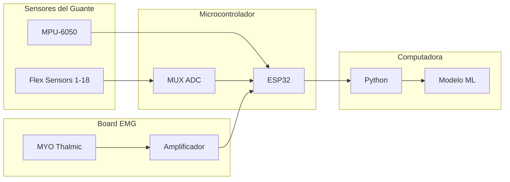
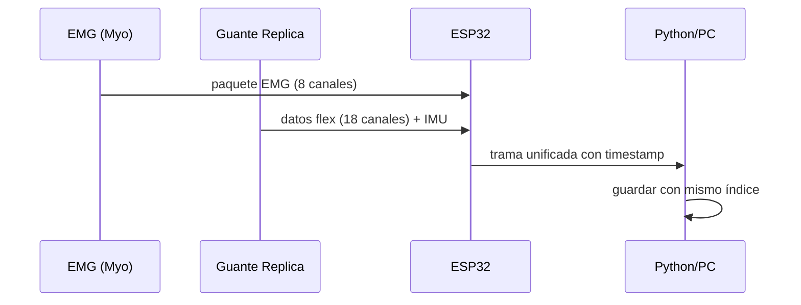
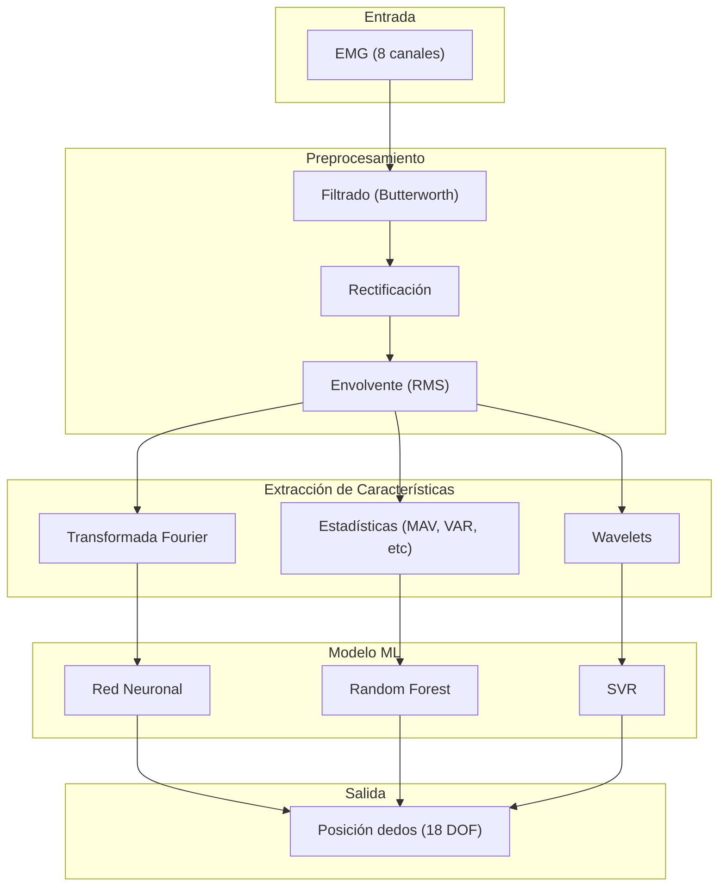

# Plan de Réplica de Sensores y Guante NinaPro

> **Objetivo**: Desarrollo de prototipo de prótesis mioeléctrica
> **Versión**: 1.0
> **Fecha**: 2026-02-18

---

## 1. Análisis del Guante Actual (Deman Robotics)

### 1.1 Especificaciones Técnicas de los 22 Sensores

El guante Deman Robotics utilizado en NinaPro DB1 contiene **22 sensores de posición de dedos** que miden la flexión de cada articulación:

| # | Sensor | Descripción | Rango Typical |
|----|--------|-------------|---------------|
| 1-4 | Dedos índice, medio, anular, meñique | Sensores de flexión proximal | 0-255 (8-bit) |
| 5-8 | Dedos índice, medio, anular, meñique | Sensores de flexión medial | 0-255 |
| 9-12 | Dedos índice, medio, anular, meñique | Sensores de flexión distal | 0-255 |
| 13 | Pulgar | Sensor de flexión MCF (Metacarpofalángica) | 0-255 |
| 14 | Pulgar | Sensor de flexión IF (Interfalángica) | 0-255 |
| 15-18 | Dedos índice, medio, anular, meñique | Sensores de abducción | 0-255 |
| 19 | Muñeca | Sensor de flexión radial | 0-255 |
| 20 | Muñeca | Sensor de flexión cubital | 0-255 |
| 21-22 | Muñeca | Sensores de rotación | 0-255 |

### 1.2 Formato de Datos del Guante

```python
# Estructura en archivos .mat NinaPro
glove_data.shape  # (n_muestras, 22)
# Valores típicos: 0-255 (uint8)
# Frecuencia de muestreo: 100 Hz (sincronizado con EMG)
```

### 1.3 Rango de Valores y Calibración

| Parámetro | Valor |
|-----------|-------|
| Resolución | 8 bits (256 niveles) |
| Rango de medición | 0° - 90° (flexión completa) |
| Voltaje de operación | 3.3V - 5V |
| Frecuencia de muestreo | 100 Hz |
| Latencia | < 10ms |

---

## 2. Diseño de la Réplica

### 2.1 Sensores Sugeridos

#### Sensores de Flexión (18 unidades)

| Opción | Modelo | Características | Costo Unit. |
|--------|--------|-----------------|--------------|
| **Recomendada** | Spectra Symbol SoftPot | 70mm lineal, 0-10kΩ | $8-12 |
| Alternativa 1 | Spectra Symbol Flex Sensor 4.5" | Resistivo, 10kΩ-100kΩ | $10-15 |
| Alternativa 2 | Adafruit 12" Flex Sensor | Resistivo, 100kΩ | $12-18 |

#### Sensores IMU (Opcional - para posición espacial)

| Opción | Modelo | Características | Costo Unit. |
|--------|--------|-----------------|--------------|
| **Recomendada** | MPU-6050 | 6-DoF, I2C, ±16g | $3-5 |
| Alternativa | MPU-9250 | 9-DoF, I2C + magnetómetro | $6-10 |

### 2.2 Configuración de Hardware

#### Arquitectura del Sistema



#### Diagrama de Conexiones

```
ESP32 GPIO Mapping:
├── GPIO 21 (SDA)     → MPU-6050 SDA
├── GPIO 22 (SCL)     → MPU-6050 SCL
├── GPIO 36 (ADC1_0)  → Multiplexor canal 0
├── GPIO 39 (ADC1_3)  → Multiplexor canal 1
├── GPIO 34 (ADC1_6)  → Multiplexor canal 2
├── GPIO 35 (ADC1_7)  → Multiplexor canal 3
├── GPIO 32 (ADC1_4)  → Multiplexor enable
└── GPIO 33           → LED estado

Multiplexor (74HC4067):
├── Y0-Y7 → Sensores flex 1-8
└── Y8-Y15 → Sensores flex 9-16
```

### 2.3 Lista de Materiales (BOM)

| Item | Cantidad | Costo Unit. | Total |
|------|----------|-------------|-------|
| ESP32 DevKit | 1 | $8-12 | $12 |
| Sensores Flex 4.5" | 18 | $12 | $216 |
| MPU-6050 | 1 | $4 | $4 |
| Multiplexor 74HC4067 | 2 | $2 | $4 |
| Resistores 10kΩ | 20 | $0.10 | $2 |
| Capacitor 100nF | 10 | $0.20 | $2 |
| PCB personalizada | 1 | $15 | $15 |
| Conectores JST | 30 | $0.50 | $15 |
| Cable flexível | 3m | $3 | $3 |
| Funda guante | 1 | $20 | $20 |
| Electrodos EMG (Myo armband) | 1 | $100-150 | $100 |
| **TOTAL** | | | **~$393** |

---

## 3. Integración con EMG

### 3.1 Sincronización de Señales

La sincronización es crítica para el mapeo EMG → posición del guante.

#### Método de Sincronización



#### Protocolo de Comunicación

```python
# Estructura de trama de datos
TRAMA_SIZE = 64 bytes
"""
Header: 2 bytes (0xAA 0x55)
Timestamp: 4 bytes (uint32, milisegundos)
EMG: 16 bytes (8 canales × 2 bytes)
Flex: 36 bytes (18 canales × 2 bytes)
IMU: 6 bytes (accel xyz + gyro xyz)
Checksum: 1 byte
"""

# Frecuencia de muestreo objetivo
FREQ_EMG = 200 Hz       # Myo Thalmic
FREQ_GLOVE = 100 Hz     # Sensores flex
FREQ_SYNC = 100 Hz      # Frecuencia unificada
```

### 3.2 Frecuencia de Muestreo

| Sistema | Frecuencia | Justificación |
|---------|------------|---------------|
| NinaPro original | 100 Hz | Estándar del estudio |
| Myo Armband | 200 Hz | Frecuencia nativa |
| **Replica propuesta** | 100 Hz | Sincronización con NinaPro |

**Estrategia de sincronización**:
1. Usar timer hardware del ESP32 para muestreo regular
2. Incluir timestamp en cada paquete de datos
3. Re-muestrear a frecuencia común en Python (100 Hz)

---

## 4. Software de Adquisición

### 4.1 Firmware ESP32

```c
// Archivo: firmware/esp32_glove_emg/main.cpp
// Configuración de pines y parámetros

#include <WiFi.h>
#include <BluetoothSerial.h>
#include <Wire.h>
#include <Adafruit_MPU6050.h>

// Configuración de pines
#define MUX_S0 32
#define MUX_S1 33
#define MUX_S2 25
#define MUX_S3 26
#define MUX_SIG 36

// Buffer de datos
const int BUFFER_SIZE = 256;
uint8_t emg_buffer[BUFFER_SIZE];
uint16_t flex_buffer[18];

// Timer para muestreo
hw_timer_t *samplingTimer = NULL;
volatile bool sample_ready = false;

void IRAM_ATTR samplingISR() {
    sample_ready = true;
}

void setup() {
    Serial.begin(115200);
    
    // Inicializar I2C para MPU-6050
    Wire.begin(21, 22);
    mpu.begin();
    
    // Configurar multiplexor
    pinMode(MUX_S0, OUTPUT);
    pinMode(MUX_S1, OUTPUT);
    pinMode(MUX_S2, OUTPUT);
    pinMode(MUX_S3, OUTPUT);
    
    // Timer para 100 Hz
    samplingTimer = timerBegin(0, 80, true);
    timerAttachInterrupt(samplingTimer, &samplingISR, true);
    timerAlarmWrite(samplingTimer, 10000, true); // 10ms = 100Hz
    timerAlarmEnable(samplingTimer);
}

void loop() {
    if (sample_ready) {
        sample_sensors();
        send_data_packet();
        sample_ready = false;
    }
}

void sample_sensors() {
    // Leer 18 sensores flex con multiplexor
    for (int i = 0; i < 18; i++) {
        setMuxChannel(i);
        flex_buffer[i] = analogRead(MUX_SIG);
    }
    
    // Leer IMU
    sensors_event_t a, g, temp;
    mpu.getEvent(&a, &g, &temp);
}

void send_data_packet() {
    // Construir trama de datos
    uint8_t packet[64];
    packet[0] = 0xAA;
    packet[1] = 0x55;
    // ... agregar timestamp, EMG, flex, IMU
    Serial.write(packet, 64);
}
```

### 4.2 Python para Adquisición

```python
# Archivo: src/data_acquisition/receiver.py
"""Módulo de adquisición de datos en tiempo real."""

import serial
import threading
import numpy as np
from collections import deque
from typing import Dict, Optional
import struct


class DataReceiver:
    """Recibe y procesa datos del ESP32 via serial."""
    
    HEADER = bytes([0xAA, 0x55])
    PACKET_SIZE = 64
    
    def __init__(self, port: str, baudrate: int = 115200):
        self.port = port
        self.baudrate = baudrate
        self.serial_conn = None
        self.running = False
        self.data_buffer = deque(maxlen=10000)
        self.emg_buffer = []
        self.flex_buffer = []
        self.imu_buffer = []
    
    def connect(self) -> bool:
        """Establecer conexión serial."""
        try:
            self.serial_conn = serial.Serial(
                port=self.port,
                baudrate=self.baudrate,
                timeout=1.0
            )
            return True
        except serial.SerialException as e:
            print(f"Error de conexión: {e}")
            return False
    
    def start_acquisition(self):
        """Iniciar hilo de adquisición."""
        self.running = True
        self.thread = threading.Thread(target=self._read_loop)
        self.thread.daemon = True
        self.thread.start()
    
    def _read_loop(self):
        """Bucle principal de lectura de datos."""
        while self.running:
            if self.serial_conn and self.serial_conn.in_waiting:
                data = self.serial_conn.read(self.PACKET_SIZE)
                if self._validate_packet(data):
                    self._parse_packet(data)
    
    def _validate_packet(self, data: bytes) -> bool:
        """Validar checksum del paquete."""
        if len(data) < self.PACKET_SIZE:
            return False
        if data[:2] != self.HEADER:
            return False
        checksum = sum(data[:-1]) & 0xFF
        return checksum == data[-1]
    
    def _parse_packet(self, data: bytes):
        """Parsear paquete de datos."""
        # timestamp: bytes 2-5
        timestamp = struct.unpack('<I', data[2:6])[0]
        
        # EMG: bytes 6-21 (8 canales × 2 bytes)
        emg = struct.unpack('<8H', data[6:22])
        
        # Flex: bytes 22-55 (18 canales × 2 bytes)
        flex = struct.unpack('<18H', data[22:58])
        
        # IMU: bytes 58-63
        accel = struct.unpack('<3h', data[58:64])
        
        # Guardar en buffers
        self.emg_buffer.append(emg)
        self.flex_buffer.append(flex)
        self.imu_buffer.append(accel)
        
        # Guardar con timestamp
        self.data_buffer.append({
            'timestamp': timestamp,
            'emg': emg,
            'flex': flex,
            'accel': accel
        })
    
    def get_latest_data(self) -> Optional[Dict]:
        """Obtener último dato disponible."""
        if self.data_buffer:
            return self.data_buffer[-1]
        return None
    
    def stop_acquisition(self):
        """Detener adquisición."""
        self.running = False
        if self.thread:
            self.thread.join()
        if self.serial_conn:
            self.serial_conn.close()
    
    def save_to_file(self, filename: str):
        """Guardar datos recopilados a archivo."""
        np.savez(
            filename,
            emg=np.array(self.emg_buffer),
            flex=np.array(self.flex_buffer),
            imu=np.array(self.imu_buffer)
        )
```

### 4.3 Script de Calibración

```python
# Archivo: src/calibration/calibrate.py
"""Calibración de sensores flex del guante."""

import numpy as np
from typing import Tuple, List


class FlexSensorCalibrator:
    """Calibrador para sensores de flexión."""
    
    def __init__(self, n_sensors: int = 18):
        self.n_sensors = n_sensors
        self.min_values = np.zeros(n_sensors)
        self.max_values = np.zeros(n_sensors)
        self.calibrated = False
    
    def collect_calibration_data(self, n_samples: int = 100) -> List[np.ndarray]:
        """
        Recolectar datos de calibración.
        
        El usuario debe:
        1. Mantener la mano completamente abierta
        2. Mantener la mano completamente cerrada
        """
        print("Calibración de sensores flex")
        print("=" * 40)
        print("1. Mantenga la mano ABIERTA y presione Enter...")
        input()
        # Capturar datos mano abierta
        open_hand = self._capture_samples(n_samples)
        
        print("2. Mantenga la mano CERRADA y presione Enter...")
        input()
        # Capturar datos mano cerrada
        closed_hand = self._capture_samples(n_samples)
        
        return [open_hand, closed_hand]
    
    def _capture_samples(self, n_samples: int) -> np.ndarray:
        """Capturar N muestras de los sensores."""
        samples = []
        for _ in range(n_samples):
            # Leer del buffer de datos
            data = get_latest_flex_data()
            if data is not None:
                samples.append(data)
        return np.array(samples)
    
    def calibrate(self, open_hand: np.ndarray, closed_hand: np.ndarray):
        """Calcular valores de calibración."""
        self.min_values = np.min(open_hand, axis=0)
        self.max_values = np.max(closed_hand, axis=0)
        self.calibrated = True
    
    def normalize(self, raw_values: np.ndarray) -> np.ndarray:
        """Normalizar valores crudos a rango 0-1."""
        if not self.calibrated:
            raise RuntimeError("Calibrador no calibrado")
        
        normalized = (raw_values - self.min_values) / (self.max_values - self.min_values)
        return np.clip(normalized, 0, 1)
    
    def raw_to_angle(self, raw_values: np.ndarray) -> np.ndarray:
        """Convertir valores crudos a ángulos en grados."""
        normalized = self.normalize(raw_values)
        angles = normalized * 90  # 0-90 grados
        return angles
    
    def save_calibration(self, filepath: str):
        """Guardar parámetros de calibración."""
        np.savez(
            filepath,
            min_values=self.min_values,
            max_values=self.max_values
        )
    
    def load_calibration(self, filepath: str):
        """Cargar parámetros de calibración."""
        data = np.load(filepath)
        self.min_values = data['min_values']
        self.max_values = data['max_values']
        self.calibrated = True
```

---

## 5. Modelo de Entrenamiento

### 5.1 Mapear Señales EMG a Posiciones del Guante



### 5.2 Arquitectura del Modelo Propuesta

```python
# Archivo: src/models/emg_to_pose.py
"""Modelo de mapeo EMG → Posición del guante."""

import numpy as np
from typing import Tuple
from sklearn.ensemble import RandomForestRegressor, GradientBoostingRegressor
from sklearn.preprocessing import StandardScaler
from sklearn.multioutput import MultiOutputRegressor
import joblib


class EMGToPoseModel:
    """Modelo para predecir posiciones del guante desde EMG."""
    
    def __init__(self, n_flex_sensors: int = 18):
        self.n_flex_sensors = n_flex_sensors
        self.scaler = StandardScaler()
        
        # Modelo para predecir 18 posiciones de dedos
        self.model = MultiOutputRegressor(
            GradientBoostingRegressor(
                n_estimators=100,
                max_depth=5,
                learning_rate=0.1
            )
        )
        
        self.is_trained = False
    
    def extract_features(self, emg_signal: np.ndarray, window_size: int = 200) -> np.ndarray:
        """
        Extraer características de señal EMG.
        
        Args:
            emg_signal: Señal EMG cruda (n_muestras, 8_canales)
            window_size: Tamaño de ventana para características
        
        Returns:
            Vector de características
        """
        features = []
        
        # Parámetros temporales
        emg_rectified = np.abs(emg_signal)
        
        # MAV (Mean Absolute Value)
        mav = np.mean(emg_rectified, axis=0)
        features.extend(mav)
        
        # RMS (Root Mean Square)
        rms = np.sqrt(np.mean(emg_signal ** 2, axis=0))
        features.extend(rms)
        
        # VAR (Variance)
        var = np.var(emg_signal, axis=0)
        features.extend(var)
        
        # WL (Waveform Length)
        wl = np.sum(np.diff(emg_signal, axis=0), axis=0)
        features.extend(wl)
        
        # ZC (Zero Crossing)
        zero_crossings = np.sum(np.diff(np.sign(emg_signal), axis=0) != 0, axis=0)
        features.extend(zero_crossings)
        
        # FFT (componentes de frecuencia)
        fft = np.fft.fft(emg_signal, axis=0)
        fft_magnitude = np.abs(fft[:window_size//2])
        features.extend(fft_magnitude.mean(axis=0))
        
        return np.array(features)
    
    def train(self, X: np.ndarray, y: np.ndarray):
        """
        Entrenar modelo.
        
        Args:
            X: Datos EMG (n_muestras, 8_canales, n_ventanas)
            y: Posiciones del guante (n_muestras, 18)
        """
        # Extraer características
        X_features = []
        for i in range(len(X)):
            feat = self.extract_features(X[i])
            X_features.append(feat)
        
        X_features = np.array(X_features)
        
        # Normalizar
        X_scaled = self.scaler.fit_transform(X_features)
        
        # Entrenar
        self.model.fit(X_scaled, y)
        self.is_trained = True
    
    def predict(self, emg_signal: np.ndarray) -> np.ndarray:
        """
        Predecir posición del guante desde EMG.
        
        Args:
            emg_signal: Señal EMG (8_canales, n_muestras)
        
        Returns:
            Posiciones predichas (18,)
        """
        if not self.is_trained:
            raise RuntimeError("Modelo no entrenado")
        
        # Extraer características
        features = self.extract_features(emg_signal).reshape(1, -1)
        
        # Normalizar
        features_scaled = self.scaler.transform(features)
        
        # Predecir
        prediction = self.model.predict(features_scaled)
        
        return prediction[0]
    
    def save_model(self, filepath: str):
        """Guardar modelo entrenado."""
        joblib.dump({
            'model': self.model,
            'scaler': self.scaler,
            'n_flex_sensors': self.n_flex_sensors
        }, filepath)
    
    def load_model(self, filepath: str):
        """Cargar modelo entrenado."""
        data = joblib.load(filepath)
        self.model = data['model']
        self.scaler = data['scaler']
        self.n_flex_sensors = data['n_flex_sensors']
        self.is_trained = True
```

### 5.3 Datos del Proyecto Existentes

El proyecto actual [`proyecto_emg_ninapro`](./proyecto_emg_ninapro/) contiene:

| Recurso | Descripción | Uso |
|---------|-------------|-----|
| [`data/raw/S1_A1_E1.mat`](./proyecto_emg_ninapro/data/raw/S1_A1_E1.mat) | Datos EMG + guante sujeto 1 | Entrenamiento inicial |
| [`data/raw/s1/S1_A1_E1.mat`](./proyecto_emg_ninapro/data/raw/s1/S1_A1_E1.mat) | Réplica de datos | Validación |
| [`src/data_loader.py`](./proyecto_emg_ninapro/src/data_loader.py) | Loader de datos NinaPro | Cargar datos de entrenamiento |
| [`src/preprocessing.py`](./proyecto_emg_ninapro/src/preprocessing.py) | Preprocesamiento EMG | Filtrado y limpieza |
| [`src/feature_extraction.py`](./proyecto_emg_ninapro/src/feature_extraction.py) | Extracción de características | Features para ML |
| [`src/models.py`](./proyecto_emg_ninapro/src/models.py) | Modelos ML existentes | Modelos base |

### 5.4 Pipeline de Entrenamiento

```python
# Archivo: src/training/train_pipeline.py
"""Pipeline completo de entrenamiento."""

from data_loader import cargar_datos_ninapro
from preprocessing import filter_emg, remove_artifacts
from feature_extraction import extract_window_features
from models import EMGToPoseModel


def prepare_training_data(data_dir: str, subjects: list):
    """Preparar datos de entrenamiento desde NinaPro."""
    X_train = []
    y_train = []
    
    for subject in subjects:
        # Cargar datos
        data = cargar_datos_ninapro(
            f"{data_dir}/S{subject:03d}_A1_E1.mat"
        )
        
        emg = data['emg']           # (n_muestras, 10)
        glove = data['glove']        # (n_muestras, 22)
        
        # Preprocesar EMG
        emg_filtered = filter_emg(emg)
        
        # Crear ventanas
        window_size = 200  # 2 segundos a 100 Hz
        step = 50          # 50% overlap
        
        for i in range(0, len(emg_filtered) - window_size, step):
            window_emg = emg_filtered[i:i+window_size]
            window_glove = glove[i+window_size]
            
            X_train.append(window_emg)
            y_train.append(window_glove)
    
    return np.array(X_train), np.array(y_train)


def main():
    # Rutas
    data_dir = "proyecto_emg_ninapro/data/raw"
    
    # Cargar datos de 5 sujetos
    X, y = prepare_training_data(data_dir, subjects=[1, 2, 3, 4, 5])
    
    print(f"Datos de entrenamiento: {X.shape}")
    print(f"Etiquetas (posiciones guante): {y.shape}")
    
    # Crear y entrenar modelo
    model = EMGToPoseModel(n_flex_sensors=18)
    model.train(X, y)
    
    # Guardar modelo
    model.save_model("models/emg_to_pose_gb.pkl")
    print("Modelo guardado en models/emg_to_pose_gb.pkl")


if __name__ == "__main__":
    main()
```

---

## 6. Plan de Implementación

### 6.1 Fases del Proyecto

| Fase | Descripción | Entregable | Duración Estimada |
|------|-------------|------------|-------------------|
| 1 | Prototipo hardware | Guante con sensores flex funcionales | 2-3 semanas |
| 2 | Integración EMG | Sistema sincronizado EMG + guante | 2 semanas |
| 3 | Adquisición datos | Scripts de captura y almacenamiento | 1 semana |
| 4 | Calibración | Sistema de calibración automatizado | 1 semana |
| 5 | Entrenamiento modelo | Modelo ML entrenado con datos NinaPro | 2 semanas |
| 6 | Validación | Pruebas en tiempo real | 2 semanas |

### 6.2 Estructura de Directorios Propuesta

```
proyecto_replica/
├── firmware/
│   └── esp32_glove_emg/
│       ├── main.cpp
│       ├── platformio.ini
│       └── lib/
│           └── MPU6050/
├── src/
│   ├── data_acquisition/
│   │   ├── receiver.py
│   │   └── recorder.py
│   ├── calibration/
│   │   ├── calibrate.py
│   │   └── calibrator.py
│   ├── models/
│   │   ├── emg_to_pose.py
│   │   └── trainer.py
│   └── utils/
│       ├── filters.py
│       └── visualization.py
├── data/
│   ├── raw/           # Datos capturados
│   ├── processed/     # Datos procesados
│   └── calibration/   # Archivos de calibración
├── models/            # Modelos entrenados
├── notebooks/
│   ├── 01_exploracion_datos.ipynb
│   ├── 02_entrenamiento_modelo.ipynb
│   └── 03_evaluacion.ipynb
├── tests/
│   ├── test_sensors.py
│   ├── test_sync.py
│   └── test_model.py
└── README.md
```

### 6.3 Consideraciones de Seguridad

1. **Seguridad eléctrica**: Usar aislación galvánica para conexiones EMG
2. **Biocompatibilidad**: Materiales no tóxicos para contacto con piel
3. **Fiabilidad**: Redundancia en sensores críticos
4. **Calibración**: Verificación periódica de calibración

---

## 7. Referencias

- [NinaPro Database](https://ninapro.hevs.ch/) - Base de datos original
- [Deman Robotics](http://www.deman.nl/) - Fabricante del guante original
- [Myo Armband](https://www.thalmic.com/myo/) - Alternativa para EMG
- [ESP32 Documentation](https://docs.espressif.com/) - Microcontrolador recomendado
- [MPU-6050](https://www.invensense.com/products/motion-tracking/6-axis/mpu-6050/) - IMU recomendada

---

## 8. Anexos

### A. Especificaciones Técnicas Completas

| Parámetro | Valor |
|-----------|-------|
| Tensión de alimentación | 5V USB |
| Consumo típico | 150mA |
| Resolución ADC | 12 bits |
| Rango sensors flex | 10kΩ - 100kΩ |
| Precisión angular | ±5° |
| Peso estimado | 150g |
| Talla | Ajustable (adulto) |

### B. Conexiones ESP32 Detalladas

```
GPIO 21 → SDA (MPU-6050)
GPIO 22 → SCL (MPU-6050)
GPIO 36 → Señal multiplexor
GPIO 32 → MUX S0
GPIO 33 → MUX S1
GPIO 25 → MUX S2
GPIO 26 → MUX S3
GPIO 34 → LED rojo
GPIO 35 → LED verde
```

---

*Documento generado para el proyecto DashboardMat - Réplica de Sensores NinaPro*
